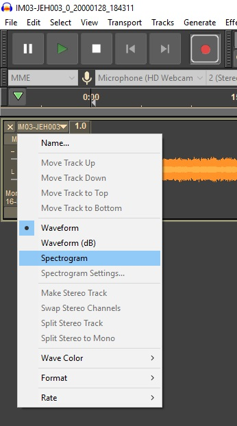
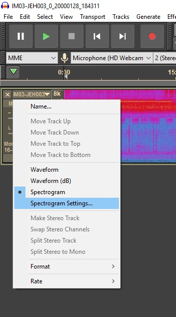
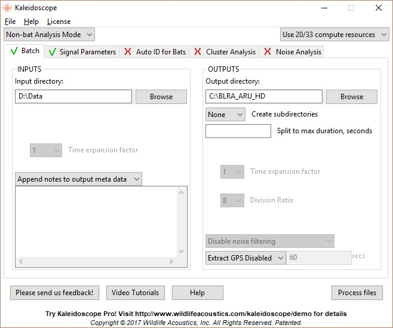

```{r setup, include=FALSE}
knitr::opts_chunk$set(echo = FALSE, fig.align = "center")
```

\fontsize{12}{14}
\selectfont

After an ARU/remote broadcast sampling event, transfer raw recordings from the SD cards to duplicate 2+ TB external hard drives for backup and analysis.

The recordings generated by a SongMeter SM2+ include the start time of the recording using the naming convention `PREFIX_YYYYMMDD_HHMMSS.wav`, where `PREFIX` is the programmed location prefix. If using the [Black Rail SongMeter 2+ (ARU) programming SOP](https://drive.google.com/open?id=1LFW3eHGa8eNBBsS4xyqox6vrlnHqznlE), the location prefix follows a \<ARU ID\>-\<survey point ID\> naming convention. Additionally, the SongMeter will record continuously but create a single stereo recording every 2 hours.

For example, consider the first two audio files generated during an ARU survey at point `CDR4H` with SongMeter `IM06`, with the recording session beginning 30 minutes before sunset on 15 April 2019 (7:10 PM; 19:10:00). The programmed location prefix would be `IM06-CDR4H`. The first 2 hour long files would thus have names similar to `IM06-CDR4H_20190415_191000.wav` and `IM06-CDR4H_20190415_211000.wav`. Subsequent files would be named similarly but with different time stamps.

## Raw recording transfer, organization, and storage

1. **Access the raw audio (`.wav`) recordings on the SD card(s) in the SongMeter.**
    a. To take out an SD card, gently push in the card. A "click" indicates the card is released from the spring-loaded slot and ready to be
removed.
    b. The SongMeter creates files under a directory called `Data`. 
    c. A single 2 hour stereo recording using the [Black Rail SongMeter 2+ (ARU) programming SOP](https://drive.google.com/open?id=1LFW3eHGa8eNBBsS4xyqox6vrlnHqznlE) settings should be approximately 620 MB.

1. **Inspect the first and last recordings on each channel for problems**
    a. Open Audacity
    b. Open the `.wav` file to inspect.
    c. From the recording dropdown menu, select `Spectrogram`.
    
        ```{r, out.width=".225\\linewidth"}
        # All defaults
        
        ```

    d. From the recording dropdown menu, select `Spectrogram Settings...`

        ```{r, out.width=".225\\linewidth"}
        # All defaults
        
        ```

    e. In the open dialog box, check `Grayscale`.
    f. Inspect the spectrogram for obvious recording issues (e.g., no or excessive background noise).
    g. Listen for a few seconds at 2 - 3 locations throughout the recording to confirm adequate recording quality.
    h. Close the recording. If prompted, do not save any changes.
    i. Repeat for the other recordings.
    j. Note that these recording issues can occur independently on the two channels, so one channel may have no recording issues while the other channel fails. Indicate whether a channel failure occurred in the ARU deployment data sheet. If so, try to locate the file in which the failure occurs and note it as well.

1. **Enter relevant information on the ARU deployment data sheet.**
    a. If recording quality expectations are met, record SongMeter SM2+ location prefix, broadcast end date (last day of broadcast sequence), pull date (date of retrieval from field), and number of recording files in the ARU deployment data sheet.

1. **Separate the stereo recordings by channel.**
    a. Open Kaleidoscope software. If it's not installed, visit the [download section of the Wildlife Acoustics website](https://www.wildlifeacoustics.com/download/kaleidoscope-software) to acquire it.
    b. Confirm the software is on the `Batch` tab and in `Non-bat Analysis Mode` (upper left corner).
    c. If you have a multi-core processor, you can elect to run this process in parallel by adjusting the `compute resources` options in the upper right corner.
    d. Under `INPUTS`, set the path of the SD card as the `Input directory`.
    e. Under `OUTPUTS`, set the `YYYY_ARU_files` directory on the primary external hard drive, where `YYYY` is the current year, as the `Output directory`.
    f. Under `OUTPUTS`, check `WAV files` and `Split channels`. 
    g. Your options should resemble the following, with appropriate modifications to `Input directory` and `Ouput directory`.
    
        ```{r, out.width=".75\\linewidth"}
        # All defaults
        
        ```
        
    h. Press `Process files` (lower right). This can take a while, particularly if using only a few `compute resources`.

1. **Copy `.wav` files to external hard drives.**
    a. Copy the approximately 60 - 100 `.wav` files generated in the `YYYY_ARU_files` directory on the primary external hard drive and copy them to the identically-named directory on the backup external hard drive.
    b. Two to four additional files may be created in the process, with names similar to `log.txt`, `meta.csv`, `db-batch.wdb.bak1`, and `settings.ini`. These can be deleted if the channel splitting process proceded smoothly. The `log.txt` file can be useful in identifying problem files if the process fails.

1. **Copy `SENSOR` files to external hard drives.**
    a. Copy any  \<ARU ID\>-\<survey point ID\>-SENSOR* files in the `Data` directory on the SD card to the `YYYY_ARU_files` directory on the primary and backup external hard drives.

1. **Prepare SD card for future deployment.**
    a. Confirm audio and sensor files were copied successfully to both external hard drives.
    b. Delete the contents of the SD card.