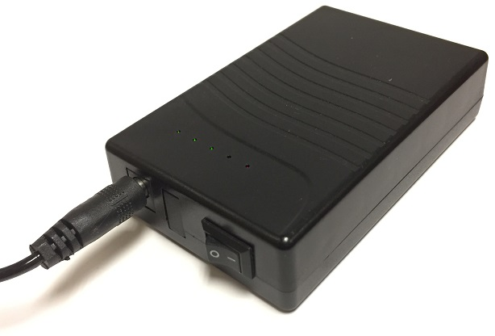

```{r setup, include=FALSE}
knitr::opts_chunk$set(echo = FALSE, fig.align = "center")
```

\fontsize{12}{14}
\selectfont

## Preparatory work

1. **Program the FoxPro NX4 game caller according to the [Black Rail FoxPro NX4 game caller programming SOP](https://drive.google.com/open?id=1xGVY6jRZ63alt0I-0p5kayuK_gv3iKme).**

1. **Program the remote broadcaster according to the [Black Rail remote broadcast unit programming SOP](https://drive.google.com/open?id=1INh3m2WPEIpn3IQthM1Y1zChPl1TFCXU).**

1. **Charge battery pack, if necessary.**
    a. Charge the 12V pack using the appropriate (12V/1A) charging cable. Charge with the toggle switch on the battery pack set to `I` (`I`nput) not `O` (`O`utput). Although the LED light will come on in both cases, the pack charges \underline{only} on `I` (`I`nput).

    ```{r, echo=FALSE, out.width = "3.75in"}
    
    ```

1. **Turn on battery pack and connect to timer.**
    a. Connect the 12V battery pack to the timer via the barrel adapter. Set the toggle switch on the battery pack to `O` (`O`utput).

1. **Connect the 12V barrel jack from the timer to the FoxPro NX4 game caller.**

1. **Center the FoxPro NX4 game caller in the case.**
    a. The forward and rear speakers should align well with the openings on each end of the enclosure.

1. **Confirm volume and speaker settings on the FoxPro NX4 game caller.**
    a. Both speakers of the game caller should be operational in open marsh and only the forward speaker operational when broadcasting from the edge of open water or upland habitat.

1. **Put the timer in automatic mode, if necessary.** 
    a. If `AUTO` is indicated along the bottom of the display, proceed to the next step.
    b. If a \manual{} icon is indicated along the bottom of the display, the timer is in `MANUAL` mode. Press the `MANUAL` button once to put the timer in automatic mode and display `AUTO`.

1. **Latch and lock the case.** 
    a. Carefully close and latch the case, ensuring the lid aligns well with, and sits snugly on, the case bottom. 
    b. Secure the combination lock.

1. **Program the SongMeter ARU according to the [Black Rail Song Meter 2+ (ARU) programming](https://drive.google.com/open?id=1LFW3eHGa8eNBBsS4xyqox6vrlnHqznlE).**

## Field deployment

1. **Install the T-post in the desired location.**
    a. When surrounded completely by marsh, the front speaker of the game caller should face magnetic North.
    b. When located on the edge of open water or upland habitat, the game caller should face the center of appropriate marsh habitat.
    c. Record the orientation of the game caller on the deployment data sheet.

1. **Install microphones**
    a. Attach microphones directly to the left and right microphone input connectors on the Song Meter. The connectors are keyed and the microphone should be pushed into the connector when oriented correctly and then locked into place by turning the locking ring on the microphone clockwise. 
    b. These microphones are fragile---they should be removed during transport to and from the field.

1. **Record ARU number and start time, sequence, location on ARU data sheet...**

1. **Return for human survey at some point...**

    