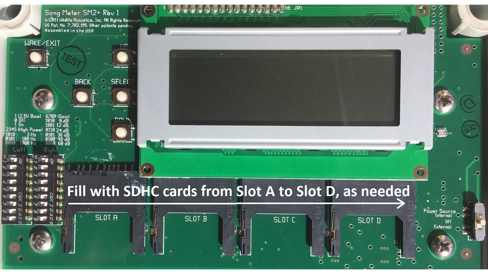
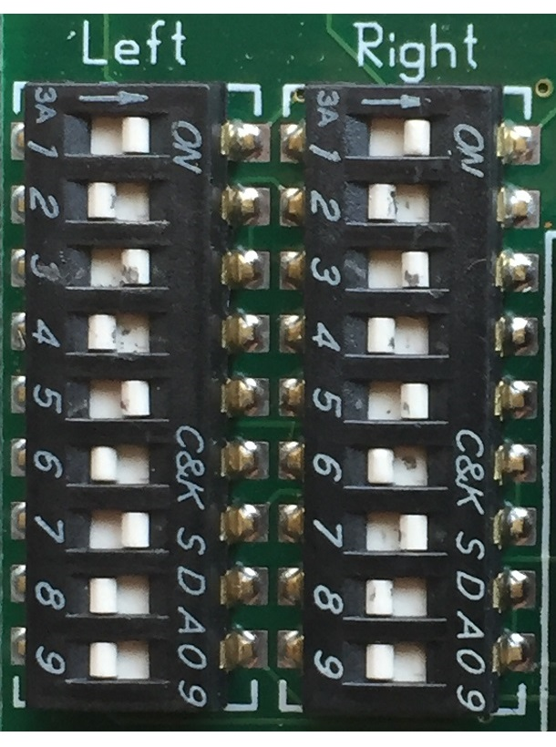

```{r setup, include=FALSE}
knitr::opts_chunk$set(echo = FALSE, fig.align = "center")
```

\fontsize{12}{14}
\selectfont

1. **Remove front panel from SongMeter (ARU)**

1. **Check/install batteries**
    a. The main power supply is 4 "D"-sized high-capacity rechargeable NiMH batteries. Make sure these are fully charged. The internal clock runs on 2 "AA" alkaline batteries. Replace (or at least check the voltage levels of) these prior to first deployment each year.

1. **Install flash cards**
    a. Insert 1 - 4 SDHC cards (16 or 32 GB; Class 10), filling from Slot A - D as needed. We have not had good luck using SDXC cards with this unit, though the SongMeter manual suggests it is possible to use them after reformatting the cards to a `FAT32` file system. Use at your own risk. 
    b. Make sure SD cards are fully inserted and secure in their Slot. They can occasionally appear installed but not be fully inserted.
    
    ```{r, out.width=".75\\linewidth"}
    # All defaults
    
    ```

1. **Check bias and gain jumper settings**
    a. Ensure bias and gain jumpers (left side of the control panel) match the following figure on both left and right channels. For users with newer SongMeter ARUs, these settings do the following:
    
        1. Set a 180Hz two-pole high-pass filter. On SongMeter 3 and 4, the nearest equivalent is 220Hz.
        2. Set the microphone pre-amplifier gain to +48dB. See the SongMeter 3 or 4 manual regarding matching this setting with those units.

    ```{r, out.width=".25\\linewidth"}
    # All defaults
    
    ```
    
1. **Power on ARU** 
    a. Flip `Power Source` switch to `Internal` (right side of control panel).

1. **Ensure up-to-date firmware version**
    a. As of `r format(Sys.time(), '%d %B, %Y')`, this is `R3.3.9` for the Song Meter SM2+. It will display on the second line of the LCD screen. For example:
        
        ```{r, comment = ""}
        cat("2019-Jan-29 13:54:00\nSong Meter II R3.3.9")
        ```
    
    b. If the firmware is current, proceed to the next step. If the firmware is out of date, download [the current version](https://drive.google.com/uc?export=download&id=1LSeH4yQw6FmvIeGtlQ2ZvZ-wKF94bMBp).
    c. Power down the ARU by flipping the `Power Source` switch to `Off`.
    d. Copy the `CURRENT_FIRMWARE.SM2` file to the top level directory of any capacity SD card.
    e. Safely eject this SD card, then insert into Slot A of the SM2+.
    f. While pressing and holding the `UP` button, power on the ARU by moving the `Power Source` switch to `Internal`.
    g. Continue holding the `UP` button until you see the message "Song Meter II Boot".
    h. Using the `UP/DOWN` buttons if necessary, navigate to the `CURRENT_FIRMWARE desired firmware file and press `SELECT`. You should see the following messages on the LCD screen: 
    
        ```{r, comment = ""}
        cat("Upgrading........\nUpgrading Complete! Press Reset to Boot")
        ```
    
    i. There is no `Reset` button on the SM2+, so flip the `Power Source` switch to `Off` and then `Internal` to reboot with the new firmware.
    j. Success will be indicated as in Step `a`.

1. **Set date/time, if necessary**
    a. Visit [time.gov](https://time.gov) to get official US time.
    b. Press `SELECT` button and navigate to `Settings` with the `DOWN` button. With `Settings` highlighted, press `SELECT` again.
    c. Highlight `Time and date` and press `SELECT`
    d. Highligh the current date and time and press `SELECT`
    e. Work through the year, month, day, hour, minutes, and seconds settings sequentially, pressing `SELECT` after each component is set.
    f. The date/time will be set when you press `SELECT` after setting the seconds component.

1. **Set sunrise/sunset reference**
    a. Navigate (using `UP/DOWN` buttons) to `Solar`, press `SELECT`, and press `UP` button until `Sunrise/set` is indicated. Press `SELECT`.
    b. Press `BACK` button to return to `Settings` menu.

1. **Set location prefix and coordinates of ARU**
    a. Navigate to `Location` and press `SELECT`
    b. Press `SELECT` and modify the location prefix. 
    c. Set the location prefix using the following convention: \<ARU ID\>-\<survey point ID\>. 
        - For example, the prefix for audio collected on Cedar Island NWR at point `CDR4H` with SongMeter `IM06` would be `IM06-CDR4H`. Only 12 alphanumeric spaces are available, so abbreviating long, historical location names may be necessary (e.g., `PTAILLIE114` becomes `PT114`).
    d. If the location prefix is less than 12 alphanumeric characters, enter a trailing blank space and press `SELECT` to finish the location prefix.
    e. Navigate to `Latitude` and press `SELECT`. Set the latitude of the location of ARU deployment.
    f. Navigate to `Longitude` and press `SELECT`. Set the longtitude of the location of ARU deployment.
    g. Navigate to `Timezone` and press `SELECT`. Set the timezone of your location relevant to UTC. All of our ARUs will operate under Eastern Daylight Time, which is `UTC - 4:00`.

1. **Confirm audio settings**
    a. Navigate to `Audio` and press `SELECT`.
    b. Set `Sample rate` to `22050`.
    c. Set `Channels` to `Stereo`.
    d. Set `File Format` to `WAV`.
    e. Set both `Gain Left` and `Gain Right` to `+ 0.0 dB`.
    g. Navigate to `Advanced Settings` and press `SELECT`.
    h. Set both `Dig HPF Left` and `Dig HPF Right` to `459`. They will display `fs/48` after setting.
    i. Ensure the following settings are `Off`: `Dig LPF Left`, `Dig LPF Right`, `Trg Lvl Left`, and `Trg Lvl Right`.
    j. Ensure `Bits` setting is `16`. The other `Trg` setting options are irrelevant provided other settings are as specified above.
    k. Press `BACK` 3X to return to the ARU Main Menu.

1. **Confirm ARU recording program**
    a. Navigate to `Schedule` and press `SELECT`. This will move the cursor to the right to choose between `advanced` and `daily` schedules.
    b. Navigate to `advanced` schedule and press `SELECT`.
    c. Confirm the following program and, if necessary, change it by `SELECT`ing each line and navigating through the options, one of which is `<Delete>` to remove a line:

        ```{r, comment = ""}
        cat("- 01 AT SSET - 00:30:00\n- 02 DO\n- 03 RECORD  02:00:00\n- 04 GOTO LINE 02 00X")
        ```

    d. Press `BACK` until you arrive at the ARU Main Menu.

1. **Power down the ARU**
    a. Flip `Power Source` switch to `Off`.
    
1. **Replace front panel on SongMeter (ARU)**
    a. The SongMeter (ARU) is now ready for [deployment](https://drive.google.com/open?id=1iHFSjoDLnAMCnjRqgh2UAGkZQQafVHLM).


