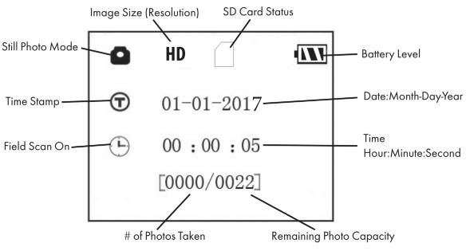
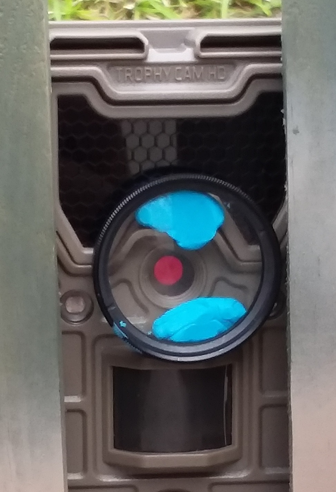

```{r setup, include=FALSE}
knitr::opts_chunk$set(echo = FALSE, fig.align = "center", fig.pos = "H")
```

\fontsize{12}{14}
\selectfont

# Prepatory work

The setup and programming steps described in this section can be done in the office prior to deployment in the field.

## Camera setup and programming

These programming parameters apply specifically to the Bushnell Trophy Cam HD Aggressor, Model nos. 119874 through 119877, but likely can be used for other related Bushnell Trophy Cam models.

1. **Install a fully-charged set of 8 AA batteries**
    a. Open the latch(es) on the right side of the Trophy Cam.
    b. If necessary, switch the Trophy Cam to `OFF` mode.
    c. Install a full set of 8 AA batteries, respecting the expected battery polarity.
    
1. **Install SD card**
    a. Insert a 32GB Class 10 SDHC card into the card slot with its label side upwards. A "click" indicates a successful card installation.

1. **Set or confirm Trophy Cam parameter settings for Black Rail use.**
    a. Switch the Trophy Cam to `SETUP` mode. This activates the LCD, and provides basic camera information.
    
        ```{r, out.width=".5\\linewidth"}
        # All defaults
        
        ```

    b. Press the `MENU` button. 
        - Pressing the `MENU` button allows you to select any parameter and change its setting. The name of the parameter and its current setting are shown on the LCD. Pressing the $\blacktriangleright$ or $\blacktriangleleft$ key scrolls to the next or previous parameter, respectively, and pressing the $\blacktriangle$ or $\blacktriangledown$ key lets you select a different setting for the currently displayed parameter. Once you select your preferred setting for a parameter, press the `OK` button to save the new setting.
    c. Use the built in LCD to navigate, change, and confirm the following settings (`Parameter`: `setting`):
        - `Set Clock`: Visit [time.gov](https://time.gov/) for current official time
        - `Presets`: `Advanced`
        - `Mode`: `Camera`
        - `Image Size`: `HD`
        - `Image Format`: `Full Screen`
        - `Capture Number`: `1 Photo`
        - `LED Control`: `Low`
        - `Camera Name`: Only 10 alphanumeric characters allowed, so use the numeric component of the Trophy Cam ID (e.g., `04` of `CAM04`) with the survey location component of the associated SongMeter 2+ ARU prefix. For example, the camera name setting of Trophy Cam `CAM05` at survey point `CDR22H` would be `05CDR22H`.
        - `Video Size`: `1920x1080`, but not used in `Camera` mode
        - `Video Length`: `10S`, but not used in `Camera` mode
        - `Interval`: `2S`
        - `Sensor Level`: `Auto`, but may revert to `Low` if too many false triggers
        - `NV Shutter`: `Auto`
        - `Camera Mode`: `24 hrs`
        - `Format`: skip, as it could reformat the SD card
        - `Time Stamp`: `On`
        - `Field Scan`: `Off`
        - `Coordinate Input`: `Off`
        - `Video Sound`: `On`, but not used in `Camera` mode
        - `Default Set`: `Cancel`
        - `Version`: not changeable, ignore
    d. When satisfied with parameter settings, press `MENU` again to exit the `SETUP` menu.
    
\clearpage

# Field deployment ("set")

## Camera trap array configuration and installation

Each camera trap array consists of four (4) camera traps. Camera traps are installed 15 - 20 m from the array center in the four magnetic cardinal directions (i.e., ignore declination). The SongMeter 2+ ARU/Remote Broadcast represents the center of the array. 

1. **Install camera traps**
    a. From ARU, navigate 15 m in first cardinal direction, using compass for direction and GPS (or calibrated steps) for distance.
    b. Identify animal trail (runway/tunnel) or other suitable microhabitat along 5 m line (between 15 and 20 m from ARU) and secure camera box in gap in vegetation with box opening positioned to align with opening(s) in vegetation (tunnel).
        - If no suitable location is found on the line, install camera box in animal trail within 2 m of line.
    c. Insert PVC pipe through brackets on side of camera box.
    d. Record relevant information on ARU deployment data sheet (e.g., camera ID, camera distance from ARU)
    e. Complete `Camera setup and programming` steps, below.
    f. Repeat steps 1a - 1e for remaining cardinal directions.

## Camera setup and programming

1. **Attach 40.5 mm +2 diopter over camera lens.**
    a. Using poster putty, attach diopter over camera lens making sure the diopter does not block the light sensor. This will mean it is **not** centered over the lens and that the upper part of the diopter covers a small part of the LED IR flash.

        ```{r, out.width=".25\\linewidth"}
        # All defaults
        
        ```

1. **Switch Trophy Cam to `ON` (Live) mode.**
    a. Open the latch(es) on the right side of the Trophy Cam.
    b. When you switch the Trophy Cam to `ON` mode, the Trophy Cam deactivates the PIR sensor for 10 seconds (the indicator LED will blink red) to allow you time to latch the Trophy Cam front cover and position on the camera box. This is pretty unreasonable, so take your time to position the Trophy Cam correctly despite any awkward photos that may result.
    c. Switch Trophy Cam to `ON` mode.
    d. Latch the front cover.

1. **Position the Trophy Cam on the back of the camera trap box.**
    a. The bottom of the Trophy Cam should sit flush with the upper surface of the box floor.
    b. Ensure the diopter has not shifted and is well-centered and secure over the Trophy Cam lens.
    c. Secure the straps.
    
## Example installation
    
```{r, out.width=".75\\linewidth"}

```


\clearpage

# Field retrieval ("pull")

1. **Deactivate camera traps.**
    a. From ARU, navigate to camera box in first cardinal direction.
    b. Remove Trophy Cam from camera box. If the camera is under water or under assault by insects, consult guidance in the `Camera retrieval troubleshooting` section below and then proceed to step 1f.
    c. Open the latch(es) on the right side of the Trophy Cam.
    d. Switch Trophy Cam to `OFF` mode.
    e. Latch the front cover.
    f. Repeat steps 1a - 1e for remaining cardinal directions.
    
## Camera retrieval troubleshooting

1. If a camera is submerged in or contains water:
    - **KEEP CAMERA IN UPRIGHT POSITION** to minimize the amount of water that reaches electronic components.
    - While maintaining upright position, open camera and allow water to drain.
    - **Do NOT turn camera off or push any buttons**.
    - After draining as much water as possible, transport in an upright position with door slightly open.
    - Return camera to office and place in low humidity area in upright position with the door open. If possible, place a fan so it blows toward/near the camera.
    - Once the camera is dry (or immediately if batteries appear to be rusting or leaking), remove all batteries. Properly dispose of any rusted or leaking batteries.
    - Consult with your supervisor about next steps.
    
1. If a camera is infested with fire ants:
    - Place and seal camera in a 1-gallon Ziploc bag, containing the infestation.
    - Upon returning to the office, place Ziploc bag containing camera and unhappy ants in freezer
    - Allow several hours to freeze and kill the ants, then remove camera from freezer.
    - Wipe off dead ants and dirt from camera, inspect seal and lens, and clean with lens wipe.
    - Proceed with normal retrieval steps.
    
1. If SD card falls in salt water:
    - Rinse immediately with freshwater and dry.
    - Allow to air dry for several hours.
    - Download data when completely dry.
    - Consult with your supervisor about next steps.

1. If battery gets wet:
    - Properly dispose of battery if it is rusting or leaking, otherwise consult with your supervisor about next steps.

