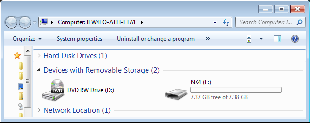
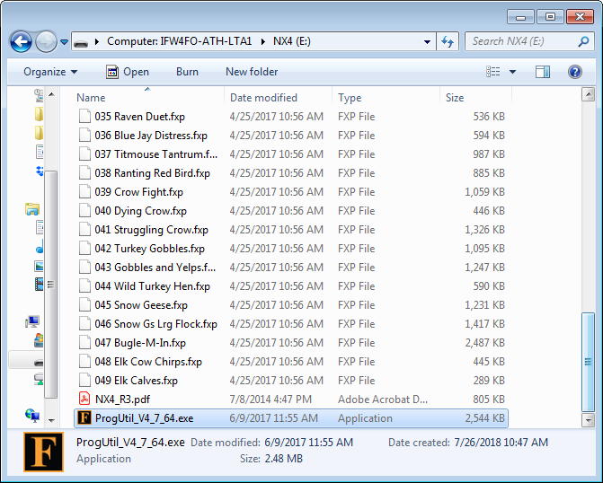
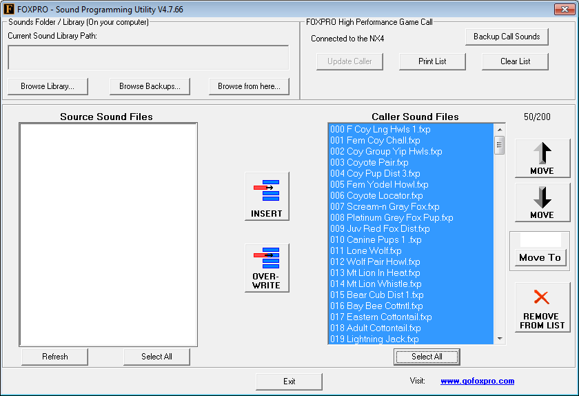
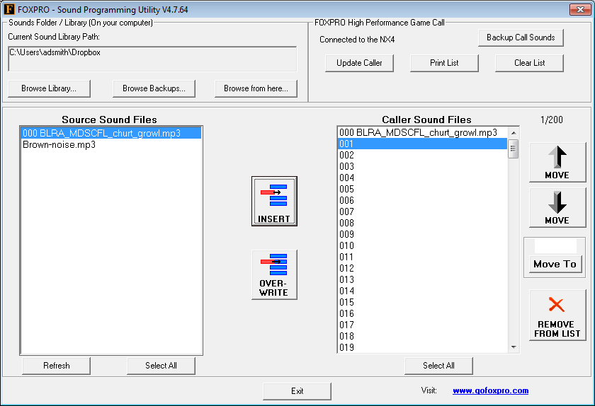
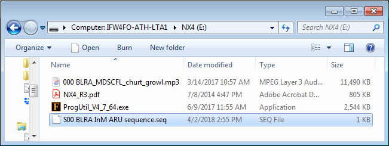

```{r setup, include=FALSE}
knitr::opts_chunk$set(echo = FALSE, fig.align = "center")
```

\fontsize{12}{14}
\selectfont

These instructions apply specifically to computers running a Windows OS.

1. **Connect the FoxPro NX4 to the computer via USB cable.**
    a. This requires an [USB 2.0 A/B cable](https://www.gofoxpro.com/products/accessories/cables/usb-2-0-ab-cable), which may have come with the FoxPro.
    b. After some driver installation, the NX4 should show up as a removable storage device in File Explorer. Open the device.
    
    ```{r, echo=FALSE, out.width = "3.75in"}
    
    ```
    
1. **Open the FoxPro Sound Programming Utility software.**
    a. The NX4 ships with a version of the software, which you can access by opening the `NX4` device in File Explorer. You may need to scroll below all the included audio files. It will be named along the lines of `ProgUtil4_7_64.exe`. Double-click this file to open the software.
    
    ```{r, echo=FALSE, out.width = "3.75in"}
    
    ```
    
    b. If you want the most up-to-date software version, or if the software is missing, it is freely available for [Windows](https://www.gofoxpro.com/service/windows-software) or [Mac](https://www.gofoxpro.com/service/mac-software).
    c. Ignore any request to back up the sounds on your caller.
    
1. **Remove any unwanted sounds on the NX4.**
    a. The NX4 typically ships with a library of 50 game calls, displayed in the `Caller Sound Files` window of the software programming interface. Press the `Select All` button below this window to select all the audio files on the NX4.
    
    ```{r, echo=FALSE, out.width = "4.75in"}
    
    ```
    
    b. Click the `REMOVE FROM LIST` button to the right of the window.
    
1. **Add the Black Rail broadcast sequence audio file to the NX4.**
    a. Click the `Browse Library` button near the top left of the interface.
    b. Browse to the location and open the [`000 BLRA_MDSCFL_churt_growl.mp3`](https://drive.google.com/open?id=1Ljx7doDjYVw4LIBGZgC3R3eWqWlG8VI0), the 12-minute playback created for use with the R4 I&M secretive marshbird surveys (2017-2019).
    c. Highlight `000 BLRA_MDSCFL_churt_growl.mp3` in the `Source Sound Files` window.
    d. Click the `INSERT` button to the right of this window to copy the file to the `Caller Sound Files` window.
    
    ```{r, echo=FALSE, out.width = "4.75in"}
    
    ```
    
    e. Click the `Update Caller` above the `Caller Sound Files` window. When finished, an `Update Complete` window should notify you of the success or failure of the update.
    
1. **Close the FoxPro Sound Programming Utility software.**

1. **Return to the `NX4` device in File Explorer (see Step 2).**

1. **Copy the [`S00 BLRA InM ARU sequence.seq`](https://drive.google.com/open?id=1Hhlx8MALwz-lNjGXGdMfNC0A2dx3BLVj) file onto the NX4 device.**
    a. This file programs the NX4 to play file `000` (the BLRA broadcast file) one time upon power up.
    b. The device should now resemble the following:
    
    ```{r, echo=FALSE, out.width = "3.75in"}
    
    ```
    
1. **Safely disconnect the NX4 from your computer.**